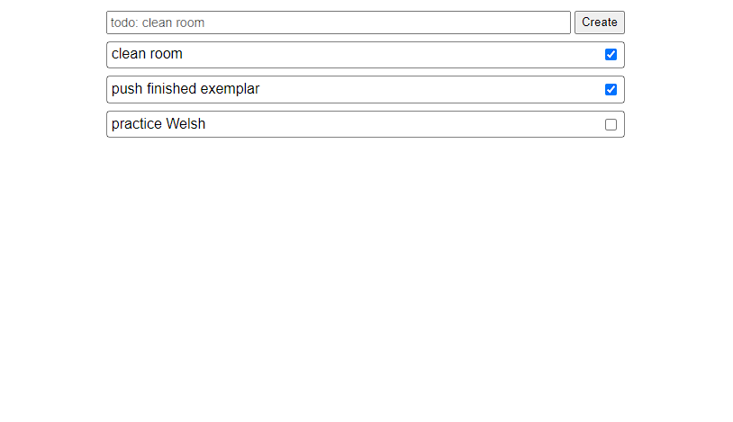

# Angular Todo List

## Learning objectives

- Be able to make HTTP requests using [HttpClient](https://angular.io/api/common/http/HttpClient)

## Setup

- Fork this repo to your own github account
- Clone your forked repo
- Open the project is VSCode
- Open a terminal and run the command `npm install` to install the dependencies

## Instructions

You've been provided a Todo List app. Currently, the Todo items only exist in-memory. Our goal is to update the app to fetch the Todos from [this external API](https://jsonplaceholder.typicode.com/). We'll only be using the `/todos` endpoint for this exercise.

implement the following requirements:

- Refactor the `todo.service.ts` file to fetch the todos from the API
- Refactor the `todo.service.ts` file to send a POST request to create a new todo
- Refactor the `todo.service.ts` file send a PUT request to update an existing todo
